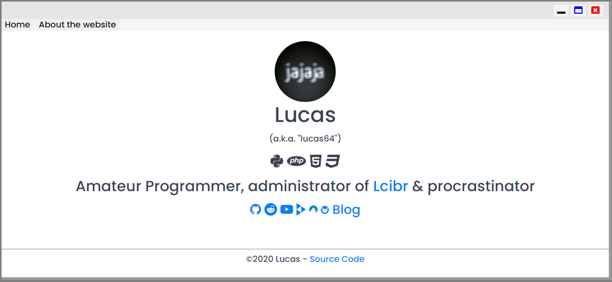
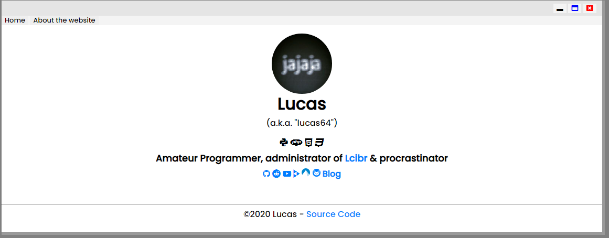

# redefault
Link this as the last before your stylesheet in a webpage with a CSS framework and get a "traditional" webpage letter design.

## Features
- Put letters into default: Get a "traditional" webpage letter design, it makes it when you import it
- Icons (3 types): use the class "icon" and it's subclasses in img to create circular icons
  - icon - normal
  - icon I - big
  - icon II - extra big
  - icon III - extra-extra big

## Install

### Download
Only you have to download "redefault.css" or "redefault.min.css" and link it like this:
#### In HTML
```
<link rel="stylesheet" href="path/to/redefault.css">
```
#### In CSS
```
@import url('path/to/redefault.css');
```

### CDN

#### Compressed
###### In HTML
```
<link rel="stylesheet" href="https://l64.gitlab.io/redefault/redefault.min.css">
```
###### In CSS
```
@import url('https://l64.gitlab.io/redefault/redefault.min.css');
```

#### Un-compressed
###### In HTML
```
<link rel="stylesheet" href="https://l64.gitlab.io/redefault/redefault.css">
```
###### In CSS
```
@import url('https://l64.gitlab.io/redefault/redefault.css');
```

## Screenshots (Using [Spectre CSS](https://picturepan2.github.io/spectre))
### Before

### After



[Lucas](https://L64.repl.co) (also known as Lucas64)

Under the Unlicense
